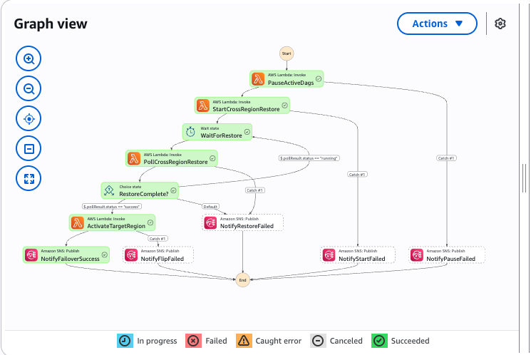

# MWAA MetaDB Backup/Restore with Failover Orchestration

Backup and restore MWAA metadata database (PostgreSQL) across regions using AWS Glue,
with optional automated failover orchestration via Step Functions.

## Overview

This example provides two layers of functionality:

1. **Base Infrastructure** — Per-region backup/restore using Glue jobs, Step Functions, and S3
2. **Failover Orchestrator** — Cross-region automated failover that chains MetaDB restore → region flip → notification

```
┌─────────────────────────────────────────────────────────────────────┐
│                        Primary Region (us-east-2)                   │
│                                                                     │
│  ┌──────────────┐   ┌──────────────────┐   ┌────────────────────┐  │
│  │ MWAA Primary │   │ Export Glue Job   │   │ S3 Backup Bucket   │  │
│  │              │──▶│ (mwaa_metadb_     │──▶│ (exports/<env>/    │  │
│  │              │   │  export.py)       │   │  YYYY/MM/DD/)      │  │
│  └──────────────┘   └──────────────────┘   └────────┬───────────┘  │
│                                                      │              │
│  ┌──────────────────────────────────────┐            │              │
│  │ Failover Orchestrator (Step Fn)      │            │              │
│  │  1. Pause DAGs in active region      │            │              │
│  │  2. Start restore in us-east-1 ──────┼────────────┼──────┐      │
│  │  3. Poll until complete              │            │      │      │
│  │  4. Update DDB + unpause target DAGs │            │      │      │
│  │  5. Send SNS notification            │            │      │      │
│  └──────────────────────────────────────┘            │      │      │
│                                                      │      │      │
│  ┌──────────────────────────────────────┐            │      │      │
│  │ Health Check Lambda (EventBridge)    │            │      │      │
│  │  → monitors primary MWAA status      │            │      │      │
│  │  → triggers orchestrator on failure  │            │      │      │
│  └──────────────────────────────────────┘            │      │      │
└──────────────────────────────────────────────────────┼──────┼──────┘
                                                       │      │
                                                       ▼      ▼
┌──────────────────────────────────────────────────────────────────────┐
│                      Secondary Region (us-east-1)                    │
│                                                                      │
│  ┌──────────────┐   ┌──────────────────┐   ┌─────────────────────┐  │
│  │ MWAA         │   │ Restore Glue Job │   │ Auto-Restore SM     │  │
│  │ Secondary    │◀──│ (mwaa_metadb_    │◀──│ (Step Functions)    │  │
│  │              │   │  restore.py)     │   │  FindBackup→Glue→   │  │
│  └──────────────┘   └──────────────────┘   │  Monitor→Validate   │  │
│                                             └─────────────────────┘  │
└──────────────────────────────────────────────────────────────────────┘
```

## Important: Planned Failover Only

> **This failover orchestrator is designed for planned failover simulations and
> MWAA-level failures — not full regional outages.** The health check Lambda,
> EventBridge rule, Step Functions, and DynamoDB state table all run in the
> primary region. If that region goes down entirely, none of these components
> will execute.
>
> For true cross-region disaster recovery where the primary region is completely
> unavailable, you should trigger the failover manually from the secondary region
> or use a multi-region orchestration pattern (e.g., Route 53 health checks with
> a failover Lambda deployed in the secondary region).
>
> This solution is well-suited for:
> - **Planned failover drills** — validate your DR process end-to-end
> - **MWAA environment failures** — scheduler crashes, environment stuck in UPDATING, etc.
> - **Maintenance windows** — gracefully move workloads to the secondary region
> - **Partial service degradation** — MWAA is unhealthy but the region's control plane is up

## Project Structure

```
metadb-backup-restore/
├── app.py                          # CDK app entry point
├── cdk.json                        # CDK configuration
├── deploy.sh                       # Deployment helper script
├── requirements.txt                # Python dependencies
├── stacks/
│   ├── metadb_backup_restore_stack.py   # Base backup/restore infrastructure
│   └── failover_orchestrator_stack.py   # Failover orchestrator (optional)
└── assets/
    ├── dags/
    │   ├── glue_mwaa_export.py     # Airflow DAG: export metadb to S3
    │   └── glue_mwaa_restore.py    # Airflow DAG: restore metadb from S3
    ├── glue/
    │   ├── mwaa_metadb_export.py   # Glue script: JDBC export to CSV
    │   └── mwaa_metadb_restore.py  # Glue script: CSV restore via pg8000
    └── lambda/
        ├── find_latest_backup.py        # Finds most recent backup in S3
        ├── trigger_restore_dag.py       # Triggers restore DAG via MWAA CLI
        ├── monitor_dag_run.py           # Monitors Glue job status directly
        ├── validate_restore.py          # Validates restore completed
        ├── start_cross_region_restore.py # Starts restore SM in another region
        ├── poll_cross_region_restore.py  # Polls cross-region SM execution
        ├── failover_flip.py             # Pauses/unpauses DAGs, updates DynamoDB
        └── health_check.py              # Monitors MWAA health, triggers failover
```

## Prerequisites

- Two MWAA environments already deployed (e.g., via the `disaster-recovery/` example)
- CDK bootstrapped in both regions (`npx cdk bootstrap aws://<ACCOUNT>/<REGION>`)
- AWS CLI configured with appropriate permissions
- Node.js and Python 3.11+

## Deployment

### Step 1: Deploy Base Stacks (Both Regions)

```bash
cd examples/metadb-backup-restore
python -m venv .venv && source .venv/bin/activate
pip install -r requirements.txt

# Deploy backup/restore infrastructure to both regions
npx cdk deploy MetaDBBackupRestorePrimary MetaDBBackupRestoreSecondary \
  -c account=<ACCOUNT_ID> --require-approval never
```

This creates per region:
- S3 bucket: `mwaa-metadb-backups-<account>-<region>`
- Glue IAM role: `mwaa-metadb-glue-<region>`
- Glue jobs for export and restore
- Auto-restore Step Function: `mwaa-metadb-auto-restore-<region>`
- Lambda functions for orchestration

### Step 2: Upload Assets to S3

CDK creates infrastructure but does not upload Glue scripts or DAG files:

```bash
ACCOUNT=<ACCOUNT_ID>

# Primary region (us-east-2)
aws s3 cp assets/glue/mwaa_metadb_export.py  s3://mwaa-metadb-backups-${ACCOUNT}-us-east-2/scripts/ --region us-east-2
aws s3 cp assets/glue/mwaa_metadb_restore.py s3://mwaa-metadb-backups-${ACCOUNT}-us-east-2/scripts/ --region us-east-2
aws s3 cp assets/dags/glue_mwaa_export.py    s3://<PRIMARY_MWAA_DAG_BUCKET>/dags/ --region us-east-2
aws s3 cp assets/dags/glue_mwaa_restore.py   s3://<PRIMARY_MWAA_DAG_BUCKET>/dags/ --region us-east-2

# Secondary region (us-east-1)
aws s3 cp assets/glue/mwaa_metadb_export.py  s3://mwaa-metadb-backups-${ACCOUNT}-us-east-1/scripts/ --region us-east-1
aws s3 cp assets/glue/mwaa_metadb_restore.py s3://mwaa-metadb-backups-${ACCOUNT}-us-east-1/scripts/ --region us-east-1
aws s3 cp assets/dags/glue_mwaa_export.py    s3://<SECONDARY_MWAA_DAG_BUCKET>/dags/ --region us-east-1
aws s3 cp assets/dags/glue_mwaa_restore.py   s3://<SECONDARY_MWAA_DAG_BUCKET>/dags/ --region us-east-1
```

The MWAA DAG bucket name is in the MWAA console under Environment details → DAGs folder.

### Step 3: Configure MWAA Airflow Configuration Options

Set these in the MWAA console (or your MWAA CDK stack's `airflow_configuration_options`):

| Key | Value | Description |
|-----|-------|-------------|
| `metadb_export.aws_region` | `us-east-2` (your region) | Region where Glue/S3 resources live |
| `metadb_export.glue_role_name` | `mwaa-metadb-glue-<region>` | Glue IAM role created by this stack |
| `metadb_export.export_s3_bucket` | `mwaa-metadb-backups-<account>-<region>` | S3 bucket for backups |
| `metadb_export.max_age_days` | `30` | Max age of records to export |

Set these on every MWAA environment that runs export or restore DAGs.
After saving, MWAA updates the environment (~5 minutes).

### Step 4: Add IAM Permissions to MWAA Execution Roles

Add this inline policy (`MetaDBGlueAccess`) to each MWAA execution role:

```json
{
    "Version": "2012-10-17",
    "Statement": [
        {
            "Effect": "Allow",
            "Action": [
                "glue:CreateConnection", "glue:DeleteConnection",
                "glue:GetConnection", "glue:UpdateConnection",
                "glue:CreateJob", "glue:UpdateJob", "glue:GetJob",
                "glue:GetJobRun", "glue:GetJobRuns", "glue:StartJobRun"
            ],
            "Resource": "*"
        },
        {
            "Effect": "Allow",
            "Action": [
                "ec2:DescribeSubnets", "ec2:DescribeSecurityGroups",
                "ec2:DescribeVpcEndpoints", "ec2:DescribeRouteTables",
                "ec2:CreateNetworkInterface", "ec2:DeleteNetworkInterface",
                "ec2:DescribeNetworkInterfaces"
            ],
            "Resource": "*"
        },
        {
            "Effect": "Allow",
            "Action": ["airflow:GetEnvironment"],
            "Resource": "*"
        },
        {
            "Effect": "Allow",
            "Action": ["iam:PassRole"],
            "Resource": "arn:aws:iam::<ACCOUNT_ID>:role/mwaa-metadb-glue-*",
            "Condition": {
                "StringEquals": { "iam:PassedToService": "glue.amazonaws.com" }
            }
        },
        {
            "Effect": "Allow",
            "Action": ["s3:GetObject", "s3:PutObject", "s3:ListBucket"],
            "Resource": [
                "arn:aws:s3:::mwaa-metadb-backups-<ACCOUNT_ID>-*",
                "arn:aws:s3:::mwaa-metadb-backups-<ACCOUNT_ID>-*/*"
            ]
        }
    ]
}
```

### Step 5: Add Cross-Region S3 Access to Glue Roles

For cross-region restore, add `CrossRegionBackupAccess` to the Glue role in the target region:

```json
{
    "Version": "2012-10-17",
    "Statement": [
        {
            "Effect": "Allow",
            "Action": ["s3:GetObject*", "s3:GetBucket*", "s3:List*"],
            "Resource": [
                "arn:aws:s3:::mwaa-metadb-backups-<ACCOUNT_ID>-<SOURCE_REGION>",
                "arn:aws:s3:::mwaa-metadb-backups-<ACCOUNT_ID>-<SOURCE_REGION>/*"
            ]
        }
    ]
}
```

### Step 6: Run an Initial Export

Before restore or failover can work, at least one export must exist:

1. Go to the primary MWAA Airflow UI
2. Trigger the `glue_mwaa_export` DAG
3. Wait for the Glue job to complete (~3-5 minutes)
4. Verify backup exists: `aws s3 ls s3://mwaa-metadb-backups-<ACCOUNT>-<REGION>/exports/<ENV_NAME>/`

Recommended: schedule exports every 15-30 minutes for fresh backups.

### Step 7: Deploy Failover Orchestrator (Optional)

```bash
npx cdk deploy FailoverOrchestrator \
  -c failover=true -c account=<ACCOUNT_ID> --require-approval never
```

This deploys to the primary region only:
- Failover Orchestrator Step Function (primary → secondary)
- Fallback Orchestrator Step Function (secondary → primary)
- Health Check Lambda + EventBridge rule (1-minute schedule)
- Failover Flip Lambda
- Cross-region restore bridge Lambdas (start + poll)
- DynamoDB state table
- SNS notification topic

### Step 8: Seed DynamoDB State

After deploying the orchestrator, seed the initial active region:

```bash
aws dynamodb put-item \
  --table-name mwaa-failover-state-<REGION> \
  --item '{
    "state_id": {"S": "ACTIVE_REGION"},
    "active_region": {"S": "<PRIMARY_REGION>"},
    "version": {"N": "0"},
    "failover_count": {"N": "0"}
  }' \
  --region <REGION>
```

### Step 9: Enable Health Check (When Ready)

The EventBridge health check rule deploys disabled by default. Enable it when
you're ready for automated health monitoring:

```bash
aws events enable-rule \
  --name mwaa-failover-health-check-<REGION> \
  --region <REGION>
```

To disable again:

```bash
aws events disable-rule \
  --name mwaa-failover-health-check-<REGION> \
  --region <REGION>
```

## Usage

### Manual Export (Airflow UI)

Trigger DAG `glue_mwaa_export` — no config needed. Exports to:
`s3://<backup-bucket>/exports/<env-name>/YYYY/MM/DD/`

### Manual Restore (Airflow UI)

Trigger DAG `glue_mwaa_restore` with config:
```json
{
    "backup_path": "s3://mwaa-metadb-backups-<account>-<region>/exports/<env-name>/YYYY/MM/DD",
    "restore_mode": "append",
    "tables": ["variable", "connection", "slot_pool", "dag_run", "task_instance"]
}
```

- `backup_path`: S3 path to backup (required)
- `restore_mode`: `append` (default) or `clean` (truncate before restore)
- `tables`: list of tables (optional, defaults to all)

### Automated Restore (Step Functions)

```bash
aws stepfunctions start-execution \
  --state-machine-arn arn:aws:states:<REGION>:<ACCOUNT>:stateMachine:mwaa-metadb-auto-restore-<REGION> \
  --input '{}' \
  --region <REGION>
```

This runs: FindLatestBackup → StartGlueRestore → MonitorGlueJob → ValidateRestore → Notify.

### Manual Failover (Step Functions)

Trigger the full failover orchestrator manually:

```bash
aws stepfunctions start-execution \
  --state-machine-arn arn:aws:states:<REGION>:<ACCOUNT>:stateMachine:mwaa-failover-orchestrator-<REGION> \
  --input '{"reason": "Manual failover test"}' \
  --region <REGION>
```

This runs the complete failover sequence (~5-6 minutes):
1. Pauses DAGs in the active (source) region to stop new writes
2. Starts the restore state machine in the secondary region
3. Polls every 60 seconds until restore completes
4. Updates DynamoDB with new active region and unpauses target DAGs
5. Sends SNS notification

### Manual Fallback to Primary (Step Functions)

After a failover, you can return workloads to the primary region using the
fallback orchestrator. This mirrors the failover flow but in reverse:

```bash
aws stepfunctions start-execution \
  --state-machine-arn arn:aws:states:<REGION>:<ACCOUNT>:stateMachine:mwaa-fallback-orchestrator-<REGION> \
  --input '{"reason": "Returning to primary after maintenance"}' \
  --region <REGION>
```

The fallback sequence (~5-6 minutes):
1. Pauses DAGs in the secondary (currently active) region
2. Starts the restore state machine in the primary region
3. Polls every 60 seconds until restore completes
4. Updates DynamoDB with primary as active region and unpauses primary DAGs
5. Sends SNS notification

> **Note:** Before running fallback, ensure the secondary region has a recent
> export so the primary gets up-to-date metadata. Run `glue_mwaa_export` on
> the secondary MWAA environment first if needed.

## Failover Orchestrator — Deep Dive

### Architecture

```
EventBridge (every 1 min)
    → Health Check Lambda
        → checks MWAA env status + scheduler heartbeat
        → tracks consecutive failures in DynamoDB
        → on threshold breach (default: 3): starts Failover Orchestrator

Failover Orchestrator Step Function:
    ┌─────────────────────────────────┐
    │ PauseActiveDags                 │  Pause DAGs in source region
    └──────────────┬──────────────────┘
                   ▼
    ┌─────────────────────────────────┐
    │ StartCrossRegionRestore         │  Lambda starts restore SM in secondary
    └──────────────┬──────────────────┘
                   ▼
    ┌─────────────────────────────────┐
    │ WaitForRestore (60s)            │◀─────────────────────┐
    └──────────────┬──────────────────┘                      │
                   ▼                                         │
    ┌─────────────────────────────────┐                      │
    │ PollCrossRegionRestore          │  Lambda checks SM status
    └──────────────┬──────────────────┘                      │
                   ▼                                         │
    ┌─────────────────────────────────┐     running          │
    │ RestoreComplete?                │──────────────────────┘
    │   success → ActivateTarget      │
    │   failed  → NotifyRestoreFailed │
    └──────────────┬──────────────────┘
                   ▼ (success)
    ┌─────────────────────────────────┐
    │ ActivateTargetRegion            │  Update DDB, unpause target DAGs
    └──────────────┬──────────────────┘
                   ▼
    ┌─────────────────────────────────┐
    │ NotifyFailoverSuccess           │  SNS notification
    └─────────────────────────────────┘
```

### Step Functions Execution View



### Why Cross-Region Lambdas?

AWS Step Functions cannot natively start executions in a different region. The
`StepFunctionsStartExecution` task only works within the same region. To bridge
this, two lightweight Lambdas handle cross-region communication:

- `start_cross_region_restore.py` — calls `stepfunctions.start_execution()` via boto3
  with an explicit `region_name` parameter
- `poll_cross_region_restore.py` — calls `stepfunctions.describe_execution()` to check
  status, returning `running`, `success`, or `failed`

The orchestrator loops (wait 60s → poll → check) until the restore completes.

### CLI Token Refresh

The flip Lambda uses a `TokenManager` class that automatically refreshes MWAA CLI
tokens before the 60-second expiry. This prevents failures when iterating over many
DAGs during pause/unpause operations.

### DynamoDB State Table

Table name: `mwaa-failover-state-<region>`

| state_id | Description |
|----------|-------------|
| `ACTIVE_REGION` | Current active region, failover count, last failover time, cooldown tracking |
| `HEALTH_<region>` | Health status, consecutive failure count, last check timestamp |

### Health Check Behavior

The health check Lambda:
1. Skips if in cooldown period (default: 30 minutes after last failover)
2. Skips if primary is not the active region (avoids double-failover)
3. Checks MWAA environment status (`AVAILABLE` = healthy)
4. Logs scheduler heartbeat warnings (does not fail on heartbeat alone)
5. Tracks consecutive failures in DynamoDB
6. Sends warning SNS notifications as failures approach threshold
7. Starts the orchestrator when threshold is reached

### Configuration Parameters

| Parameter | Default | Description |
|-----------|---------|-------------|
| `health_check_interval` | `rate(1 minute)` | How often to check primary health |
| `failure_threshold` | `3` | Consecutive failures before triggering failover |
| `cooldown_minutes` | `30` | Cooldown period after a failover (prevents flapping) |
| `notification_email` | `""` | Email for SNS notifications (optional) |

These are set in `app.py` when instantiating `FailoverOrchestratorStack`.

## How It Works (Technical Details)

### Export Process
1. DAG runs inside MWAA, reads DB credentials from environment variables
2. Creates a Glue JDBC connection with real credentials and MWAA VPC config
3. Updates the Glue job to attach the connection (places Glue ENIs in MWAA VPC)
4. Glue job reads tables via Spark JDBC, writes pipe-delimited CSV to S3

### Restore Process
1. Glue job reads CSV from S3
2. Connects to target MWAA metadb via pg8000 (pure Python PostgreSQL driver)
3. Restores using PostgreSQL `COPY FROM STDIN` for performance
4. Writes restore summary to the local region's backup bucket

### Airflow Compatibility
Works with both Airflow 2.x (`SQL_ALCHEMY_CONN`) and Airflow 3.x (`DB_SECRETS`/`POSTGRES_HOST`).

## CDK Stacks Reference

| Stack | Region | Description |
|-------|--------|-------------|
| `MetaDBBackupRestorePrimary` | Primary | Export/restore infrastructure for primary |
| `MetaDBBackupRestoreSecondary` | Secondary | Export/restore infrastructure for secondary |
| `FailoverOrchestrator` | Primary | Failover + fallback orchestration (deploy with `-c failover=true`) |

The `FailoverOrchestrator` stack includes both:
- `mwaa-failover-orchestrator-<region>` — primary → secondary failover
- `mwaa-fallback-orchestrator-<region>` — secondary → primary fallback

## Troubleshooting

### "No backups found" error in orchestrator
Run an export first from the primary MWAA environment. The restore SM looks for
backups in `s3://mwaa-metadb-backups-<account>-<primary-region>/exports/<env-name>/`.

### Restore DAG shows "failed" in Airflow UI but Glue job succeeded
This is expected. The restore DAG uses a fire-and-forget pattern — it starts the Glue
job and returns. The Celery executor may time out the task before the response comes back.
The Step Functions monitor Lambda checks the Glue job directly, so the orchestrator
correctly detects success regardless of the DAG status.

### Health check triggering failover unexpectedly
The EventBridge rule deploys disabled by default. If you've enabled it and it's
triggering unexpectedly, disable it:
```bash
aws events disable-rule --name mwaa-failover-health-check-<REGION> --region <REGION>
```

### Cross-region restore fails with AccessDenied
Ensure the Glue role in the target region has `CrossRegionBackupAccess` policy
(see Step 5 above).
